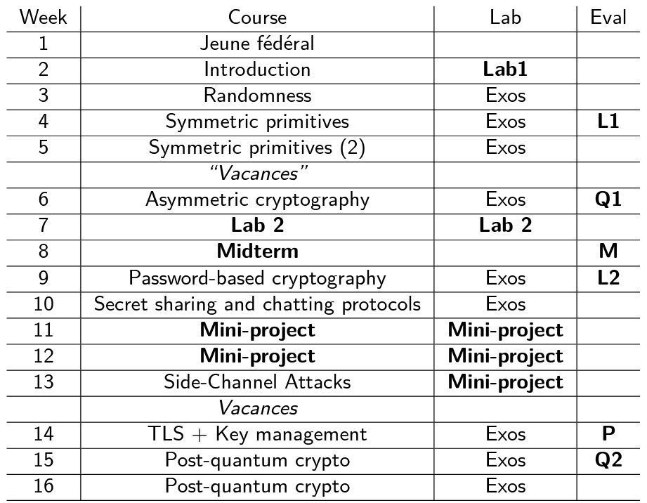
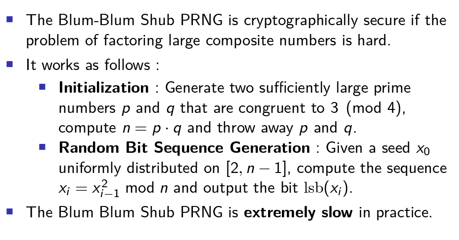

# Notes

## Timeline 

## Randomness

What are the risks if they are not perfectly random ?

We can brute force the range.
If there is a probabability that its one or 0. We can start directly with 1 for an example and add zeros on the way down.

### Random number gen

A random number generator is a physical or computiation device that generates a sequence of numbers that appear to be random.

### Statistical tests

### True Random Number Generators

A true random number generator is an apparatus that generators random numbers from a physical process.

### Bad TRNGS

### Bit Distribution properties

- Bias of a bit
- Independent bits

### Randomness Extraction Neuann

### PRNG

PRGN is deterministic.

Is a deterministi algorith whose aim is to generate a sequence of numbers exhibiting good statistical properties.

### Bad PRNGs : Mersenne Twiser.

### Cryptographically Secure PRNGs

### Blum Blum Shub PRNG

The issue is that the person that generates p and q must throws it away because it can be used as a backdoor.

### Blum-Micali PRNG

### Forward and Backward Security

### Backward Security

Backward security requires injecting fresh entropy.

Seeding, reseeding and value generation.

N'est pas 100% sure. Il faut utiliser un TRNG.

### Sources of Entropy

Avant le kernel 5.6 linux, dev random était blocant donc en utilisant le mouvement de la souris. Il fallait attendre qu'il y avait assez d'entropy dans le systeme.

dev/urandom qui est un cprng qui utilise le systeme de reseed. Il est non blocant, mais ça pouvait devenir deterministe. Le processus ID est utilisé pour généré les valeurs aléatoires. 

Il faut de l'entropy, et maintenant il bloque sur le systeme moderne.

### Intel's RDSEED and RDRAND

Dans chaque coeur, c'est un RDSEED different.

### RNRAND/RDSEED is not perfect

Il faut checker le carry flag pour savoir s'il y a eu un retour de valeur aléatoire.  Il faut lire le carry flag pour savoir si dans le registre.

### Pool of Entropy

**Dans les OS (maybe not windows)** : 

new = old xor data
Un attaquant peut retrouver le new et supprimé l'entropy du système s'il a accès à la ram.

**Ce qui se fait dans OpenSSL** :

new = Hash( old || data )

Ca empeche d'arriver à 0.

### Cryptographic PRNGs

### Hash_DRBG

### CTR_DRBG

### DUAL_EC_DRBG

Jamais utilisé.

### Randomness Generation in Practice

## Symmetric Primitives and modes of Operation

### Block Ciphers

 - Camlia
   - 
 - DES
   - Key is small asf
 - RC6
 - TwoFish
 - AES
   - Futur
 - Serpent
   - 
 - Blowfish
 - Threefish
 - Triple-DES
   - Legacy -> la clef est beaucoup plus grande. Et n'est pas efficace. Taille de block trop petit.
  
  
### Triple-DES

Version with 2 keys (112 bits) and one with 3 keys (168 bits). You can do a meet in the middle attaque.

### AES 

Block size of 128 bits, 192, 256 bits. Good security, fast on most platforms, large block size, strong design process.

Ethe encryption and decprytion algrithms are rather different.

### Camellia

Block size 128 bits, key size of 128, 192 and 256 bits.

Good security reasonbly fast on most platforms, large block size. Less efficient than AES

### Serpent

Might have a bigger security margin than AES.

But is much slower than AES.

### Block Cipher Block Size

A cause de l'attaque par anniversaire. Check IPAD!

### Padding

Here are the standards.

Check the IPAD.

## Hash Functions

Les versions avec les slash. Les autres sont des versions tronqués.

### SHA-1 

On peut trouver des collisions facilement.

### SHA-2 

### SHA-3
Using the sponge construction. -> Voir IPAD

### SHA-3 Instances 

### Keakf Internal Permutation

### Shambles Attack

On choisi une partie commun et vu que c'est Markle, on peut ajouter des valeurs a la fin. On peut rendre la collision exploitable sur SHA-1.

### Disk Encryption

## Asymmetric primitives and Security Definitions

## Password-Based Cryptography and Key-derivation functions (KDF)

## Secret Shariung and Cryptographic Protocols

## TLS and Key Management

